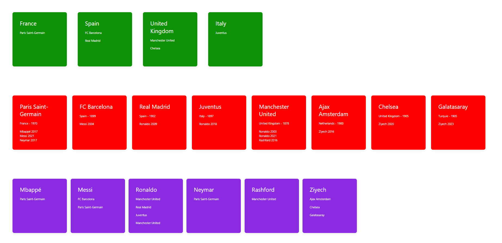

# Football - Project

## Description

Ce projet est une application de gestion de carrière pour un joueur de football. L'objectif est de modéliser des entités telles que les **clubs**, **joueurs** et **carrières** en utilisant la programmation orientée objet (POO). Chaque joueur peut être associé à plusieurs clubs et chaque club peut avoir plusieurs joueurs. L'application permet de créer des clubs, d'ajouter des joueurs à ces clubs, et de gérer les carrières des joueurs (année de début, année de fin, etc.).

### Fonctionnalités principales

- Gestion des clubs : création de clubs, récupération du nom des clubs, etc.
- Gestion des joueurs : ajout de joueurs, récupération des informations des joueurs.
- Gestion des carrières : gestion des carrières des joueurs (année de début, année de fin).
- Affichage dynamique des clubs, des joueurs et des carrières via des méthodes d'affichage personnalisées.

   
   ```bash
   git clone https://github.com/votre-compte/football-manager.git

